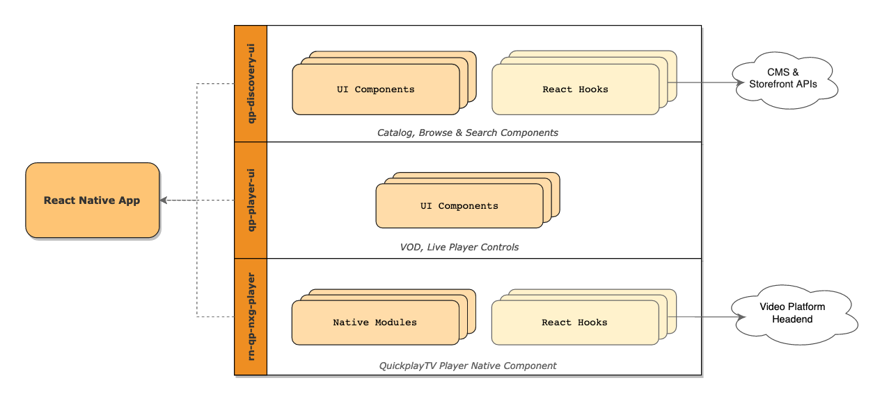

0.# TVPass App

[jj]: http://jenkins.quickplay.local/view/SingTel/view/CI/job/react-native-b2b-ci/
[e]: https://git.devops.quickplay.com/b2b-client-team/react-native-demo/blob/master/SETUP_RN.md
[ds]: https://quickplay.atlassian.net/wiki/spaces/CBSD/pages/25952402/B2B+Demo+-+Discovery+Spec

[](http://jenkins-qp.dtveng.net/view/VSTBLIB/view/CI/job/react-native-b2b-ci/job/master/)
[](https://sonarqube.devops.quickplay.com/sonar/dashboard?id=rn-components)
[](https://sonarqube.devops.quickplay.com/sonar/dashboard?id=rn-components)
[](https://sonarqube.devops.quickplay.com/sonar/dashboard?id=rn-components)
[](https://sonarqube.devops.quickplay.com/sonar/dashboard?id=rn-components)
[](https://sonarqube.devops.quickplay.com/sonar/dashboard?id=rn-components)
[](https://sonarqube.devops.quickplay.com/sonar/dashboard?id=rn-components)

## 🏛Overview

The QuickplayTV UI/UX is a library to build video applications for any screen / form factor. By design it is built on React Native which enables truly cross-platform application development. The flexible configurations provide ability to easily set UX branding on the application for the customer needs. This library also includes a fully integrated UI App with the QuickplayTV platform. It can also integrate with any third-party head-end solution.

Here's an overview of the architecture:



## Setup React Native

Please see our [setup guide][e] to install and setup RN on MacOS and Windows.

```
Note: We need Xcode 11.4+ for iOS app development.
```

### React Native 0.62.2

We have migrated to RN 0.62.2
Some of the notable changes in this update:

1. Support for tvOS has been deprecated from RN mainline. It has been moved to a react-native-community and henceforth will be maintained there (https://github.com/react-native-community/react-native-tvos)

2. Flipper is supported by default from this version. Flipper is a debugging platform for iOS, Android and React Native applications (https://github.com/facebook/flipper)

3. Local images aren't loading whn building the project using Xcode 12+ and running the app on iOS 14. We are currently working-around this issue by patching RN as described here: https://github.com/facebook/react-native/issues/29237 (Note: RN 0.63.2 has a fix for this for the react- native-tvos fork hasn't been updated as of this update)

### React Native 0.60.5

We have recently migrated to RN 0.60.4, which brings some some breaking changes on Android (migration to AndroidX) and iOS (using Cocoapods by-default for dependency management).

We have seen several issues during the migration and have made some hacks/work-around to get the builds to a stable state.

Here are some of the hacks:

1. React Native Screens project does not list tvOS as a supported platform in their podspec; we are working around this by updating the `.podspec` file on `npm postinstall`. We are tracking this [PR](https://github.com/kmagiera/react-native-screens/pull/83), before we can remove this hack.
   Update on 07/07/2020 - This PR is still open and they are not supporting tvOS even in version RN-Screens - 2.9.0

2. React Native lists some iOS only libraries as being available on tvOS too. We are working-around this by manually removing these libraries from Pods-B2BDemo-tvOS target. We are tracking this [PR](https://github.com/facebook/react-native/pull/25736/files), before we can remove this hack.

3. Looks like iOS, tvOS builds could fail on any Xcode version below Xcode 10.2; See [this issue](https://github.com/facebook/react-native/issues/25578) for more details. Some of our build machines still seem to have Xcode 9.\* as the default target, in which case builds might fail. If we observe such failures, we will have to update builds script to switch Xcode version.

4. Our build machines do not have `cocoapods` installed, so we are checking in the generated `Pods` folder in git to mitigate this until we get it installed on all build machines. This is also required until we fix #2.

## Customization

The following customization options should be made available for App development teams:

1. Curate a custom App Skeleton via CMS. See [here][ds] for more details.
2. Override default Styles & Config via API
3. Override specific Layout implementations via Component API
4. Define entirely custom UI Layout and Navigation, but leverage only Custom Hooks

## 📋 TODO

### Architecture & Infrastructure

-   [x] Setup ESLint, Prettier
-   [x] Setup `qp-discovery-ui` module
-   [x] Setup SampleApp
-   [x] Setup N/W fetching with custom hooks
-   [x] Allow Theme/Style overrides from App
    -   Support Responsive Design (mobile, tv, tablets)
-   [x] Unit Tests
-   [x] Setup custom pre-commit hooks to validate ESLint, Prettier and Unit Tests
-   [x] Design Error Handling
-   [x] Add Jenkins Pipeline for generating builds
-   [x] E2E Tests
-   [x] Generate JS Docs
-   [x] Handle Network Reachability
-   [] Localization
-   [] Accessibility Best Practices
-   [] Build in-house n/w wrapper implementation (avoid dependency on react-fetching-library)
-   [x] Implement RAM bundles & Other Performance Optimizations. See [here](http://facebook.github.io/react-native/docs/performance)
-   [] Remote Styles and Configuration updates

### Components

-   [x] ResizableImage Component
-   [x] DiscoveryCatalog Component
-   [] Add support for embedded Navigation Containers within DiscoveryCatalog
-   [x] DiscoveryNavigationTabs Component
-   [x] Carousel Component
-   [x] Carousel Pagination Component
-   [x] DiscoveryResourceDetail Component
    -   Poster
    -   Info
    -   Seasons
    -   Related
-   [] CommentThread Component
-   [x] Like/Unlike Component
-   [x] DiscoverySearch Component
-   [x] Player Component
-   [x] PlayerUI Component
-   [] UMS Component (Login/Sign up)
-   [x] EPG Component

### Responsive Styling - Best Practices

1. Always design layouts using Flexbox or Percentage widths & heights, margins and paddings.

    - RN [supports](https://github.com/facebook/react-native/commit/3f49e743bea730907066677c7cbfbb1260677d11) percentage on the following properties:

        ```bash
        padding;
        margin;
        width;
        height;
        minWidth;
        minHeight;
        maxWidth;
        maxHeight;
        flexBasis;
        ```

    - Percentage widths or margins within an Horizontal `FlatList` seems to crash the app (as of RN 0.59). We are currently using proportional absolute (using the exported `percentage(value: number, absoluteValue: boolean)` method) values only in these cases.

    - Leverage `aspectRatio` property to contain views to a specific aspect ratio, instead of specifying both width and height, this is especially useful for `Image` wrapper views.

    - [Yoga Playground](https://yogalayout.com/playground) - Useful for designing Flex layouts.

2. Use proportional font sizes to ensure the text is readable across device types. Use `scale(value: number)` to define the font-sizes.

3. Use RN's `Platform.select()` and `qp-discovery-ui`'s `selectDeviceType(spec, defaultValue)` to define Platform or Device Type specific customizations.

### Unit Tests

We use [Jest](https://jestjs.io/) to write Unit Tests. To run the tests on entire package, run:

```bash
npm test
```

To _update_ an existing snapshot definition, run:

```bash
npm test -- -u
```

To run tests on a specific spec file, run:

```bash
npm test -- <filename>.tsx
```

To generate coverage badges, run the following and then commit the modified SVG files in `${SRC_ROOT}/badges/`:

```bash
npm run test:badges
```

### E2E Tests

We are using [Appium](http://appium.io/) to write end-to-end tests for ReactNative.

#### Running Android Tests

-   Install dependencies

    ```bash
    npm install
    ```

-   Open an Android Emulator or connect an Android device to the machine
-   Build a Release version of the app

    ```bash
    cd android && ./gradlew assembleRelease
    ```

-   Start Appium Server

    ```bash
    npm run start:appium
    ```

-   Run e2e tests

    ```bash
    npm run test:e2e:android
    ```

-   Stop Appium Server

    ```bash
    npm run stop:appium
    ```

#### Running iOS Tests

-   Install dependencies

    ```bash
    npm install
    ```

-   Build a Release version of the app

    ```bash
    react-native run-ios --configuration Release
    ```

-   Start Appium Server

    ```bash
    npm run start:appium
    ```

-   Run e2e tests

    ```bash
    npm run test:e2e:ios
    ```

-   Stop Appium Server

    ```bash
    npm run stop:appium
    ```

#### Known Issues

-   On iOS Simulator typing via E2E tests may not work unless the following option in enabled.

    ```text
    Hardware -> Keyboard -> Toggle Software Keyboard (⌘K)
    ```

-   react-native-tab-view has the following issue where we couldn't navigate to the selected tab scene in tvOS and Android tv
    https://github.com/react-native-community/react-native-tab-view/issues/886
    We made a workaround to use Material tabs(https://www.npmjs.com/package/react-native-material-tabs) for tvOS and Android tv

### ESLint

We use eslint and Prettier to maintain consistent code style across the code base. Please review `.prettierrc.js` and `.eslintrc.json` for the configured rules. Feel free to raise a PR to update these rules.

### Git Hooks

#### Pre-commit

We are using `husky` and `lint-staged` packages to configure a pre-commit workflow.

On every commit, only the _staged_ files are automatically evaluated against the configured eslint and prettier rules. Any auto-fixable errors would be fixed and staged automatically.

#### Pre-push

While pushing the code to origin, tests related to the file in the last commit are automatically run.

We have also configured `jest` to treat unit tests as a failure when the coverage drops below the configured thresholds. See `jest.config.js` for the threshold configuration.

### Documentation

We use Docusaurus for maintaining our [documentation](https://pages.git.devops.quickplay.com/b2b-client-team/react-native-demo/).

The edit the documentation, update the `.md` files in `<root>/docs/website`.

To publish the docs,

```bash
cd docs/website
GIT_USER=<username> npm run deploy
```

### CICD

#### Jenkins Pipeline

Jenkins Multi-branch Pipeline Job: [http://jenkins.quickplay.local/buildStatus/icon?job=react-native-b2b-ci/][jj]

#### Release Train Configuration

1. Runs ESLint and generates Checkstyle report.

2. Runs Jest tests and generates JUnit report.

3. Generates Cobertura Code Coverage report.

4. Build iOS (Release) and Android (Debug) builds.

5. Pushes the generates builds to [App Center](https://appcenter.ms/orgs/client-lib-sampleapp/apps/), when building from `master` branch.

#### Tips

1. Include `[ci skip]` anywhere in the commit message on a feature branch to avoid a CI build. This is intended for skip wait time on a trivial commit (README updates, documentation change, or any non-code, non-configuration related changes), do not use it unwisely :). If this is useful, we could in the future consider a more robust solution as prescribed [here](https://circleci.com/blog/circleci-hacks-automate-the-decision-to-skip-builds-using-a-git-hook/).
# TV_Pass
